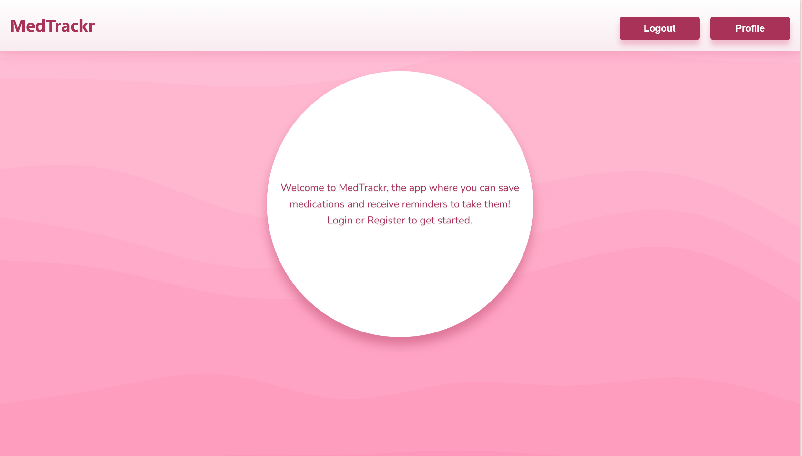
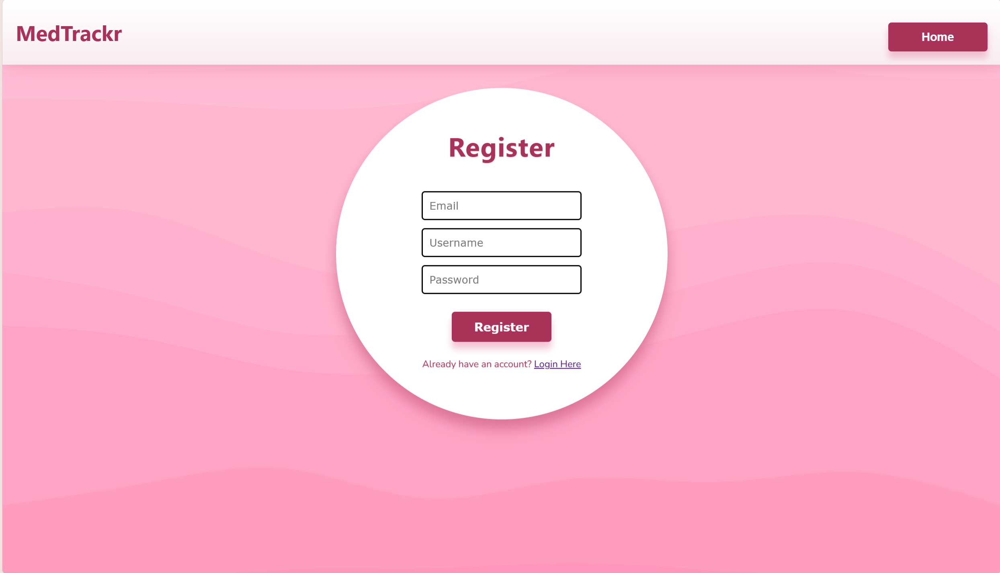
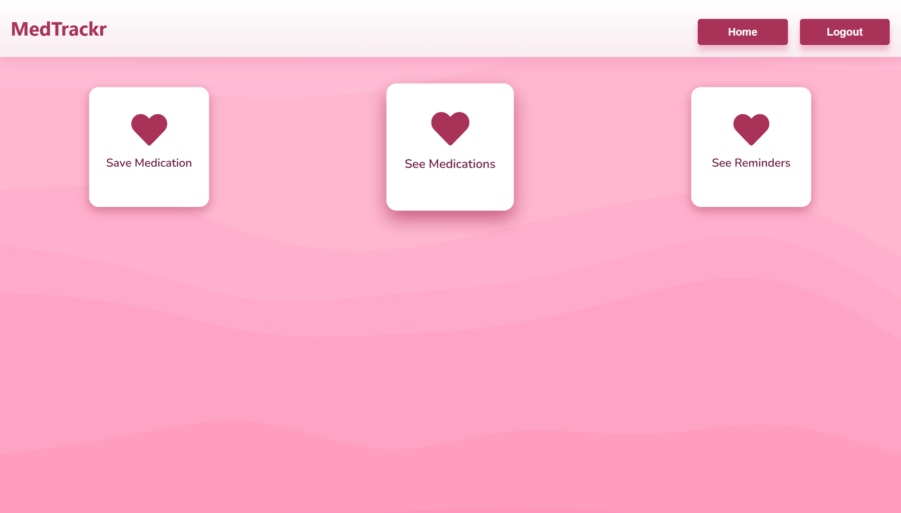
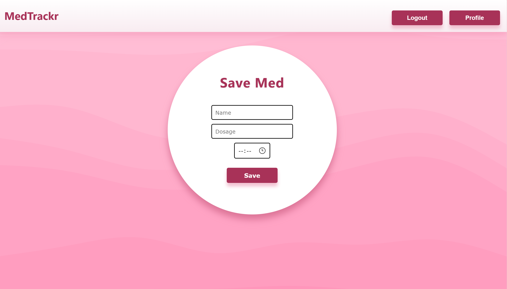

# 💊 MedTrackr

**MedTrackr** is a full-stack application built with **Spring Boot** (backend) and **React** (frontend) that helps users **save medications and receive reminders** in real time. It demonstrates features such as WebSockets, JWT authentication, and email verification.

---

> ⚠️ **Note:** This repository contains a demo version of the project that cannot be run directly. The full application requires database setup and email configuration. The code is included to showcase architecture, features, and implementation.

## ✨ Features

- **🧑‍💻 User Registration & Authentication**  
  - Secure login and registration using **JWT tokens**.  
  - Email verification via **JavaMail**. *(Requires configuration in `application.properties`.)*  

- **💊 Medication Management**  
  - Save multiple medications using **multithreading**.  
  - Real-time updates using **WebSockets**.  

- **⏰ Real-Time Reminders**  
  - Notifications and reminders for medications in real-time.  

- **🗄️ Database Integration**  
  - Uses **MySQL** to store user and medication data. *(Requires configuration in `application.properties`.)*    

---

## 🛠️ Technologies Used

- **Backend:** Spring Boot, Java, WebSockets, Multithreading, JavaMail, JWT  
- **Frontend:** React, HTML, CSS, JavaScript  
- **Database:** MySQL  
- **Other:** REST APIs

---

## 🎬 Demo

Here are some screenshots showcasing the app’s interface and functionality:

  
*Home Page interface*

  
*Register and login interface*

  
*Personal Profile Page to see information*

  
*Page to save medications*

## ⚠️ Privacy Disclaimer
This project is a demo for educational purposes, due to the handling of sensitive medication and personal health data.

## 🛠️ Work in Progress
This project still requires some further development. Upcoming improvements include:
- Adding "Resend Verification Code" functionality
- Double-checking and fixing potential bugs
- Improving exception handling and throwing more precise errors
- **Threading:** Current per-medication threads are not scalable. Use `ScheduledExecutorService` or Spring `@Scheduled`.
- **Persistence:** Reminders are lost on server restart. Consider storing next reminder in DB or using Quartz.
- **Async I/O:** Reminder delivery currently blocks threads; should be async for better performance.
- Further enhancing security and real-time features
